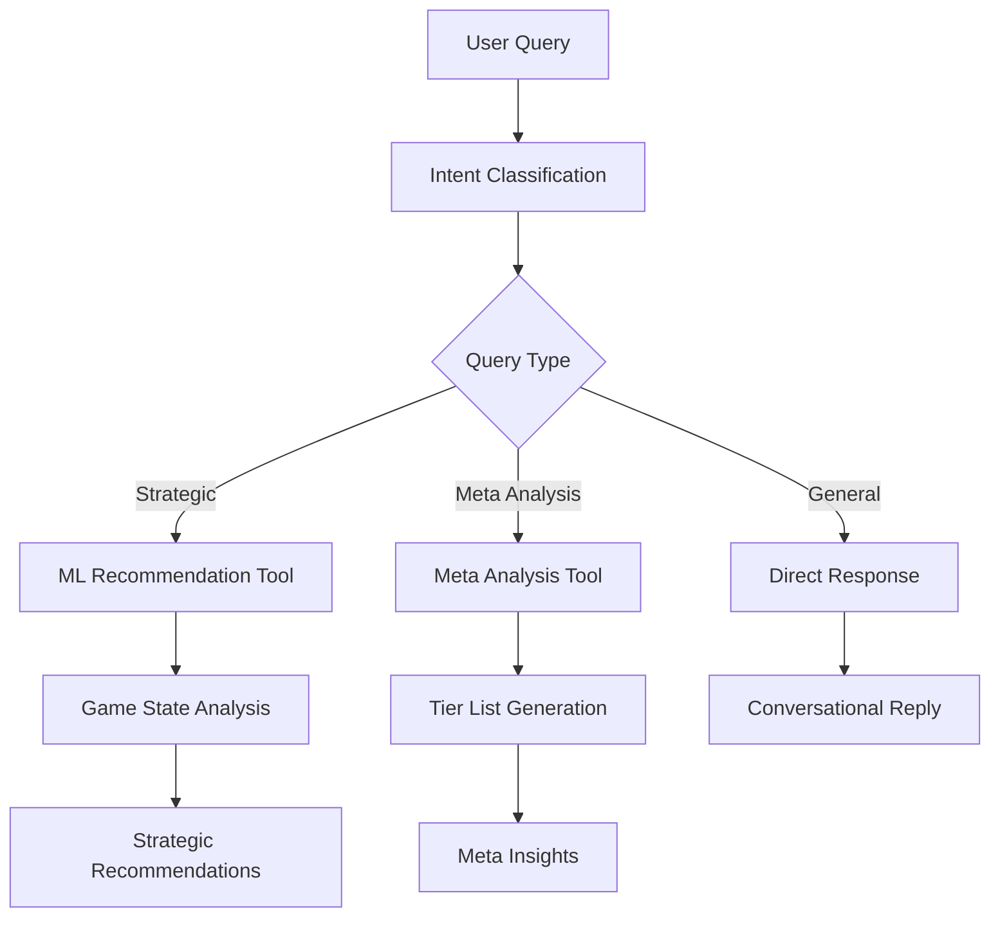

# 🎮 TFT Composition Analyzer

[](https://python.org)
[](https://typer.tiangolo.com/)
[](https://rich.readthedocs.io/)
[](LICENSE)

**AI-Powered Strategic Analysis Tool for Teamfight Tactics Set 15: K.O. Coliseum**

An intelligent analysis platform combining modern CLI interfaces, machine learning models, and AI agents to provide strategic recommendations, meta analysis, and comprehensive champion databases for TFT gameplay optimization.

---

## ✨ Features

### 🤖 **Intelligent AI Agent**
- **LangGraph Workflow**: Multi-step strategic analysis using state graphs
- **Conversation Classification**: Automatic routing between strategic decisions and meta analysis
- **Context-Aware Responses**: Game state extraction and intelligent tool selection
- **Multiple LLM Support**: Works with both Anthropic Claude and OpenAI GPT models

### 💻 **Professional CLI Interface**
- **Modern Typer Framework**: Professional command-line interface with subcommands
- **Rich Visual Output**: Beautiful tables, progress bars, and formatted displays
- **Direct Command Access**: Scriptable commands for integration and automation
- **Interactive & Non-Interactive Modes**: Flexible usage patterns

### 📊 **Advanced Meta Analysis**
- **Live Tier Lists**: Current meta compositions with win rates and placements
- **Trend Analysis**: Rising and falling compositions over time
- **Enhanced Data Integration**: MetaTFT.com data with 10+ compositions across 5 tiers
- **Strategic Recommendations**: AI-powered insights for climbing ranked

### 🎯 **Comprehensive Database**
- **Complete Set 15 Data**: All 66 champions and 26 traits (including recovered Mighty Mech)
- **Advanced Filtering**: Search by cost, trait, or name with comprehensive details
- **Trait Synergies**: Full trait combinations and champion relationships
- **Non-Truncated Views**: Complete data display without artificial limits

### 🧠 **Machine Learning Engine**
- **Real-Time Training**: 24-hour data collection with current patch filtering
- **Strategic Recommendations**: ML-powered decision making for gold, leveling, and pivoting
- **Streaming Architecture**: Adaptive models that evolve with the meta
- **High-Rank Focus**: Challenger, Grandmaster, and Master player data prioritization

### 🌐 **Streamlit Web Interface**
- **Interactive Dashboard**: Web-based interface for casual users
- **Agent Integration**: Same AI agents available through web interface
- **Visual Analytics**: Charts and graphs for meta trends and analysis
- **Real-Time Updates**: Live data refresh and model updates

---

## 🚀 Quick Start

### Installation

```bash
# Clone repository
git clone https://github.com/yourusername/tft-comp-analyzer.git
cd tft-comp-analyzer

# Install dependencies with uv (recommended)
uv sync

# Or with pip
pip install -e .

# Copy environment configuration
cp .env.example .env
# Edit .env with your API keys
```

### Configuration

Add your API keys to `.env`:

```bash
# Required for AI features
ANTHROPIC_API_KEY=your_anthropic_key  # Preferred
OPENAI_API_KEY=your_openai_key       # Alternative

# Required for live data
RIOT_API_KEY=your_riot_development_key

# Optional settings
LLM_PROVIDER=anthropic
RIOT_REGION=euw1
```

---

## 🎯 Usage

### Modern CLI Interface (Recommended)

The primary interface is our professional Typer-based CLI with Rich visual output:

```bash
# Show all available commands
./tft --help

# System status and data overview
./tft status
```

#### 💬 **AI Strategic Chat**

```bash
# Ask strategic questions
./tft chat ask "I'm at 30 gold, level 6, what should I do?"

# Interactive chat mode
./tft chat interactive

# Show example questions
./tft chat interactive --examples
```

#### 📊 **Meta Analysis**

```bash
# Current tier lists with detailed compositions
./tft meta tiers

# Meta trends analysis
./tft meta trends --days 7 --trait "Mighty Mech"

# Filter compositions by tier
./tft meta comps --tier S
```

#### 🎯 **Champion & Trait Database**

```bash
# Complete champion database (non-truncated)
./tft database champions --all

# Search specific champion
./tft database champions --name "Lee Sin"

# Filter by cost or trait
./tft database champions --cost 5
./tft database champions --trait "Stance Master"

# Browse all traits with champion lists
./tft database traits --champions

# Search functionality
./tft database search "Mighty Mech"
```

#### 🤖 **Machine Learning**

```bash
# Get strategic recommendations
./tft ml recommend --gold 45 --level 7 --stage 4

# Quick model retrain with recent data
./tft ml train --quick

# Full training pipeline
./tft ml train --matches 150 --rank CHALLENGER
```

### Web Interface

```bash
# Launch Streamlit dashboard
streamlit run streamlit_app.py
```

Access at `http://localhost:8501` for the interactive web interface with the same AI agents and data.

### Demo & Examples

```bash
# Run CLI demo
uv run python demos/demo_enhanced_cli.py

# Test agent functionality
uv run python demos/tft_agent_demo.py

# ML tool demonstration
uv run python demos/demo_ml_tool.py

# Show all CLI examples
./tft examples
```

---

## 🏗️ Architecture

### Core Components

```
tft-comp-analyzer/
├── src/tft_analyzer/
│   ├── agents/           # AI agents with LangGraph
│   ├── data/            # Data management and APIs
│   ├── ml/              # Machine learning models
│   ├── tools/           # Strategic analysis tools
│   ├── chat/            # Chat interfaces
│   └── typer_cli.py     # Modern CLI interface
├── config/              # Settings and configuration
├── scripts/             # Training and data scripts
├── demos/               # Demo and example scripts
└── streamlit_app.py     # Web dashboard
```

### AI Agent Workflow



### Data Pipeline

1. **Real-Time Collection**: Riot API data with 24-hour filtering
2. **Enhanced Processing**: MetaTFT integration with composition analysis
3. **ML Training**: Streaming models with drift detection
4. **Agent Integration**: Tools access processed data via managers
5. **Multi-Interface**: CLI, Web, and API access to same data

---

## 🔧 Advanced Configuration

### Model Training

```bash
# 24-hour training with current patch data
uv run python scripts/train_model_24h.py --full-pipeline

# Automated scheduling every 6 hours
uv run python scripts/auto_retrain_scheduler.py --interval 6

# Quick daily retrain
uv run python scripts/quick_retrain.py
```

### Data Management

```bash
# Update meta data with current patch
uv run python scripts/update_meta_data.py

# Validate data currency and quality
uv run python scripts/validate_meta_data.py

# Enhance meta data with compositions
uv run python scripts/enhance_meta_with_compositions.py
```

### Development Commands

```bash
# Code formatting
uv run black src/ config/
uv run ruff check src/ config/

# Type checking
uv run mypy src/ config/

# Testing
uv run pytest
```

---

## 📊 Data Sources

### Live Data Integration
- **Riot Games API**: Live match data, player statistics, and champion information
- **Real-Time Filtering**: Only matches from current patch (15.3+) and last 24 hours
- **High-Rank Focus**: Challenger, Grandmaster, and Master players only

### Enhanced Meta Data
- **MetaTFT.com Integration**: Professional tier lists and composition analysis
- **10+ Compositions**: S through C tier with detailed breakdowns
- **Performance Metrics**: Win rates, average placements, and play rates
- **Trend Analysis**: Rising, falling, and stable compositions

### Champion Database
- **Complete Set 15**: All 66 champions with accurate trait mappings
- **26 Traits**: Including recovered "Mighty Mech" trait data
- **Cost Distribution**: 1-5 cost units with proper categorization
- **Trait Synergies**: Complete interaction and activation data

---

## 🤝 Contributing

We welcome contributions! Please check our [contribution guidelines](CONTRIBUTING.md) and:

1. **Fork** the repository
2. **Create** a feature branch
3. **Add** tests for new functionality
4. **Ensure** code passes linting and type checking
5. **Submit** a pull request with clear description

### Development Setup

```bash
# Install development dependencies
uv sync --extra dev

# Run pre-commit hooks
pre-commit install

# Run full test suite
uv run pytest -v
```

---

## 📜 License

This project is licensed under the MIT License - see the [LICENSE](LICENSE) file for details.

---

## 🙏 Acknowledgments

- **Riot Games** for the comprehensive TFT API
- **MetaTFT.com** for professional meta analysis data
- **Typer & Rich** for modern CLI framework
- **LangChain/LangGraph** for agent orchestration
- **Anthropic Claude** for intelligent strategic analysis

---

## 📈 Project Stats

- **Languages**: Python 3.9+
- **CLI Framework**: Typer with Rich
- **AI Models**: Anthropic Claude, OpenAI GPT
- **Data Processing**: Polars DataFrames
- **ML Framework**: Scikit-learn with streaming updates
- **Web Interface**: Streamlit
- **Agent Framework**: LangGraph state machines

---

**Ready to dominate TFT Set 15? Get strategic insights powered by AI!** 🏆

```bash
./tft chat ask "Help me climb to Challenger!"
```